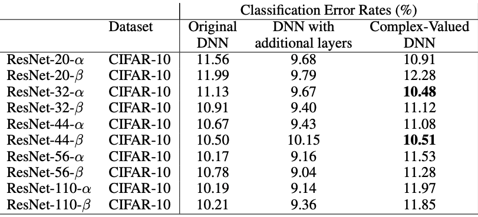
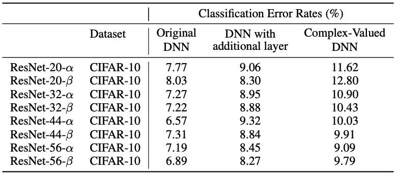
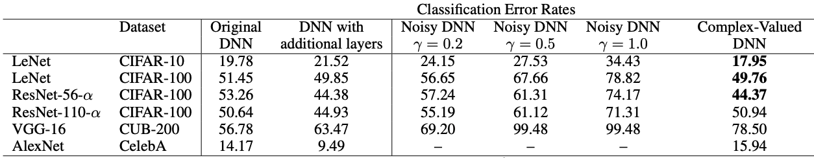
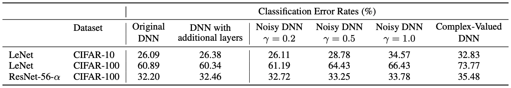
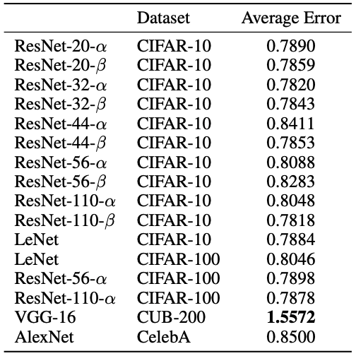
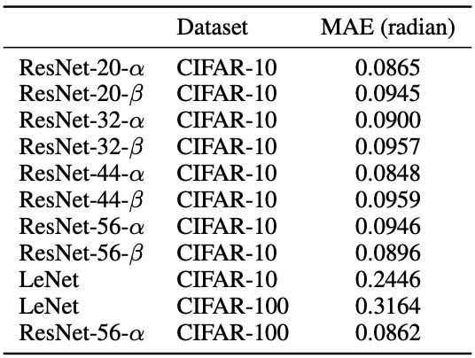

# Interpretable Complex-Valued Neural Networks for Privacy Protection

Implementation of paper by Xiang et al. ([ICLR Poster](https://iclr.cc/virtual/poster_S1xFl64tDr.html), [Paper PDF](http://www.openreview.net/pdf?id=S1xFl64tDr)).
Full report will be available soon at [OpenReview](https://api.openreview.net/forum?id=XX26O1HXupp&noteId=rQEKyH2LlHa).

In this work, we examine the reproducibility of the quantitative results reported by Xiang et al. Since no publicly available implementation currently exists, we write our own in PyTorch.


## Claims
As the authors do not provide training details in their work, we do not aim to obtain the exact reported metrics. Instead, we focus on the claims that the proposed complex-valued networks are secure against inversion and property inference attacks while maintaining similar performance as the real-value counterparts.

## Usage
The only requirements are PyTorch (tested with 1.7.1) and PyTorch Lightning (1.1.5).
```
pip install pytorch_lightning
```

We include shell [scripts](scripts/) for usage examples along with a [Colab notebook](https://colab.research.google.com/drive/1ZFEJxBh7IpgF-VnmGrUCkZOgsFiyr3fH?usp=sharing). 
We also publish our **trained models** for most of the reported results: 
[[1]](https://drive.google.com/drive/folders/1r2ALBrRja0fnRMD1STps96XTIXIY2P3G?usp=sharing), 
[[2]](https://drive.google.com/file/d/1JF1VrWDQJkDCFvdschQDIPtsH8sAkpS3/view?usp=sharing). 

Implementation details for complex-valued DNNs, attacks, and our findings are included in the [report](https://api.openreview.net/forum?id=XX26O1HXupp&noteId=rQEKyH2LlHa).

## Results
### Baseline models – image classification
|Original paper   |Our implementation   |
|-----------------|---------------------|
|||

**Original paper**


**Our implementation**


### Average error of the estimated rotation angle in radian
|Original paper   |Our implementation   |
|-----------------|---------------------|
|||

